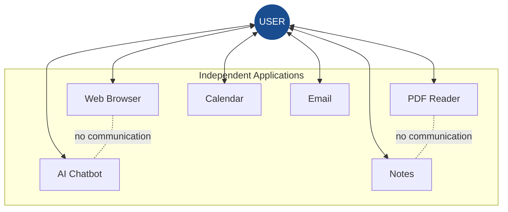
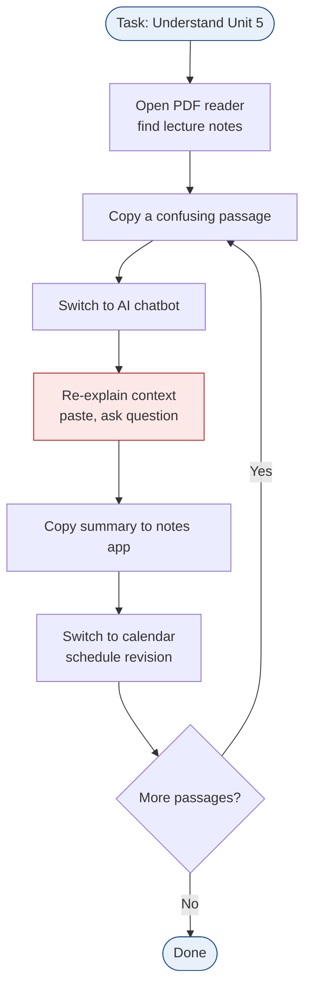

# Chapter 2
# Understanding the Problem

> *"A problem well understood is a problem half solved."*
> — Charles Kettering

---

# Learning Objectives

After completing this chapter, the reader will be able to:

- Explain why modern computing remains inefficient despite powerful hardware and AI.
- Define workflow fragmentation and the context problem.
- Identify the gaps left by existing tools and AI assistants.
- State the core engineering problem that AXIS is designed to solve.

---

# 2.1 Introduction

Computers have never been faster, and software has never been more capable. With large language models, machines can understand natural language, summarize documents, and generate code in seconds.

Yet the everyday experience of using a computer has improved far less than the tools themselves. A typical session still means opening many applications, searching for files by hand, copying information between windows, and re-explaining the same background to every program.

The bottleneck is no longer speed or intelligence — it is **coordination**. Each tool is powerful in isolation, but nothing connects them into a system that understands what the user is actually trying to accomplish.

---

# 2.2 The Fragmentation Problem

Modern computing is built around independent applications. A browser retrieves information, an editor manipulates code, a calendar tracks time. This separation makes each program simpler to build — but the cost falls on the user.

Consider a student preparing for an exam. In one session they may use a browser, an AI chatbot, a PDF reader, a notes app, a calendar, and email. Every application performs its task well. None of them knows the others exist, and none knows they are all serving one goal: *pass the exam next Tuesday*.

The user therefore becomes the integration layer. They carry information between applications by hand and hold the overall plan entirely in their own head. This condition is called **workflow fragmentation**.

Fragmentation has three costs:

1. **Time** — switching and copying accumulates into hours every week.
2. **Cognitive load** — the user must remember where everything lives and what comes next.
3. **Lost context** — every switch discards the working state of the previous tool.

Fragmentation is not caused by bad software. It is caused by the *absence* of software whose job is coordination.

---

## Figure 2.1 — The User as the Integration Layer

**Caption:** *Figure 2.1 — Every application communicates only with the user, who manually carries information between tools.*

## Figure Explanation

Every solid line in Figure 2.1 passes through the user. The browser cannot hand a result to the notes app, and the calendar cannot inform the chatbot of a deadline. The dotted lines mark connections that should exist but do not.

The user sits at the center by necessity — they are the only component that knows the overall goal. AXIS is designed to occupy that position instead, so the user can operate at the level of intent rather than mechanics.

---

# 2.3 The Context Problem

The second failure of modern computing is that software forgets. Context — who the user is, what they are working on, what has already been discussed — is discarded constantly.

The clearest example is the AI chatbot. Each new conversation begins from zero, and the user must re-introduce their project, decisions, and goals every session. The assistant is intelligent within a conversation but has the long-term memory of a stranger.

For a system to act as a genuine partner, context must be:

- **Persistent** — it survives between sessions.
- **Portable** — it is available to every capability, not locked in one app.
- **User-controlled** — the user decides what is remembered and can delete it.

This is a founding requirement of AXIS, implemented later as the Memory module.

---

## Figure 2.2 — A Fragmented Workflow, Step by Step

**Caption:** *Figure 2.2 — One study task today. Highlighted: context must be re-explained on every iteration.*

## Flowchart Explanation

Only a fraction of the steps in Figure 2.2 represent real intellectual work. The rest — opening, copying, switching, re-explaining — is coordination overhead, repeated for every passage.

The highlighted step is the most expensive: because the chatbot holds no persistent context, the user pays a re-explanation tax on every loop. In AXIS, the same task collapses into one instruction, because one system holds the documents, the memory, and the calendar.

---

# 2.4 Existing Approaches and Their Gaps

These problems are not unrecognized. Several tool categories address parts of them — and where each falls short defines the space AXIS must occupy.

**AI chatbots** (ChatGPT, Claude, Gemini) provide powerful reasoning, but operate in a sandbox: limited memory across sessions, no awareness of the screen or file system, and little ability to operate applications.

**OS assistants** (Windows Copilot, Siri) are integrated into the desktop but shallow. They handle single commands, not multi-step workflows, deep context, or custom hardware.

**Automation tools** (AutoHotkey, Zapier, shell scripts) genuinely connect applications, but they are rule-based. Every workflow must be programmed in advance, and they cannot adapt or understand language.

**Smart-home platforms** (Home Assistant) solve unified control — but only for household devices, not documents, code, or desktop workflows.

Each category solves one slice: intelligence without integration, or integration without intelligence. That gap is precisely the shape of AXIS.

---

# 2.5 Defining the Core Problem

The analysis above reduces to a single statement — the project's formal problem definition:

> **Modern computing lacks a unified intelligence layer — a system that understands user intent, maintains persistent context, coordinates independent applications, and interacts with hardware, while keeping the user in control.**

Note what this does *not* say. The problem is not slow computers, weak AI, or badly designed apps. The problem is architectural: a missing layer between the user and their tools. AXIS is an attempt to build that layer.

---

## Table 2.1 — Current Computing vs. AXIS

| Dimension | Current Computing | AXIS |
|---|---|---|
| Applications | Independent, unaware of each other | Coordinated through one platform |
| Workflow | Manual, user-driven | Automated, intent-driven |
| Context | Lost between sessions | Persistent and user-controlled |
| Interaction | One interface per app | Single interface (voice or text) |
| Automation | Rule-based, pre-programmed | Adaptive and context-aware |
| Memory | Temporary | Long-term, platform-wide |
| Hardware | Separate ecosystems | Integrated via Device Hub |
| Role of the user | Integration layer | Director of intent |

---

# 💡 Engineering Insight

The most common failure of ambitious projects is not technical — it is building before the problem is defined. A team that begins with "let's use AI agents" has chosen a solution and is searching for a problem to justify it.

This chapter deliberately contains no technology choices. Everything here would remain true regardless of programming language or AI model. When any future design decision is questioned, the answer should trace back to one test: *does it serve the problem definition in Section 2.5?*

---

# Chapter Summary

Modern computing suffers from two structural failures. **Workflow fragmentation** forces the user to act as the integration layer between independent applications. The **context problem** means software forgets the user between sessions and across tools.

Existing approaches — chatbots, OS assistants, automation tools, smart-home platforms — each solve only a fragment. The chapter concluded with the formal problem definition: the absence of a unified, context-aware, user-controlled intelligence layer between people and their tools.

---

# Key Takeaways

- The bottleneck in modern computing is coordination, not speed or intelligence.
- Fragmentation makes the user the manual integration layer between applications.
- Persistent, portable, user-controlled context is the foundation of a genuine AI partner.
- Existing tools offer intelligence without integration, or integration without intelligence.
- The core problem is architectural — a missing intelligence layer.

---

# Self Assessment

1. What is workflow fragmentation, and what are its three costs?
2. Why is the user described as "the integration layer"?
3. What three properties must context have?
4. Pick one tool category from Section 2.4 — what does it solve, and what does it miss?
5. State the problem definition from Section 2.5 from memory.

---

# Assignment

Observe your computer usage for one full day and keep a log:

- Every application you open.
- Every switch between applications, with a one-word reason.
- Every piece of information you manually carried between apps.
- Every time you re-explained context a system should already have known.

Then write down the **three most expensive coordination problems** in your own workflow. Keep this list — when AXIS is functional, these are the first things it must solve for *you*.

---

# Next Chapter

## Chapter 3 — Requirements & Scope

A well-defined problem must become concrete, testable requirements. The next chapter specifies what AXIS v1 must do, what it deliberately will not do, and how success will be measured.

---

> *"A well-defined problem is the foundation of every great engineering solution."*
